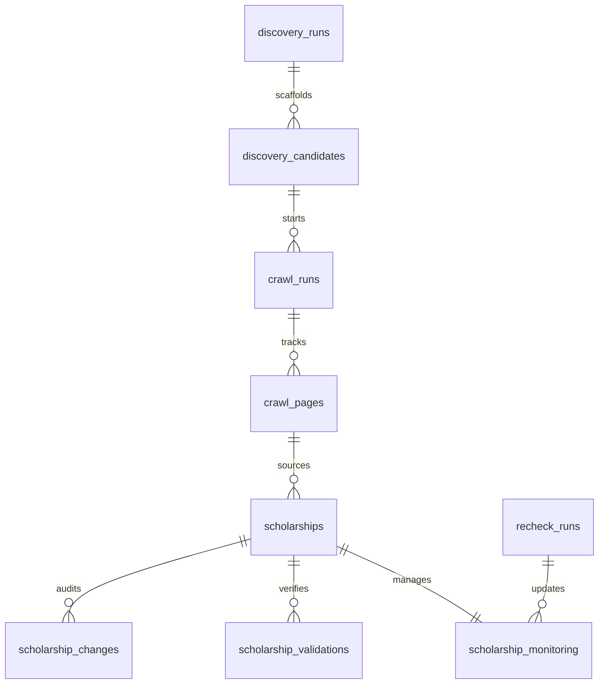

# System Architecture & Product Requirements Document (PRD)
## Scholarship Discovery, Verification & Monitoring Automation System

---

## 1. Product Overview & Requirements (PRD)

The **Scholarship Automation System** is an end-to-end software pipeline designed to automate the discovery, classification, validation, and continuous monitoring of scholarship schemes. The system replaces manual research with an automated pipeline that crawls search engines, extracts structured data, runs confidence scoring, and monitors target pages for changes or dead links.

### Core Product Objectives:
1. **Automated Discovery**: Scan search engines using targeted queries to find candidate pages.
2. **Deterministic & LLM Extraction**: Extract structured data (dates, urls, organizations, types) from target pages.
3. **Multi-criteria Validation**: Score legitimacy based on domain trust, reachability, and keyword matches.
4. **Anti-Hallucination Guardrails**: Verify extracted schemes against literal page content.
5. **Continuous Rechecking**: Periodically inspect pages to update application deadlines, detect deactivated schemes, or log reactivated status.
6. **Relational History Log**: Maintain an audit trail of every field update or status switch over time.
7. **Real-time Console Stream**: Stream backend execution output live to the dashboard terminal via Server-Sent Events (SSE).

---

## 2. Technology Stack & Choices

The system is built on a split architecture separating the pipeline processor from the relational persistence layer.

| Layer | Technology Choice | Rationale |
|---|---|---|
| **Pipeline Core** | Python 3.12 | Native support for advanced web scraping, beautifulsoup, and data pipelines. |
| **API Mediator** | FastAPI | High-performance asynchronous HTTP framework; handles background tasks and SSE logs natively. |
| **Database & Auth** | Supabase (PostgreSQL) | Fully-managed relational DB with built-in pg_cron scheduler, trigger functions, and instant REST API. |
| **Search Engine** | DuckDuckGo HTML Search | Zero-auth search extraction using the `ddgs` library. |
| **Frontend UI** | React 19 + Vite | Rapid UI compiling, fast page state hot-reloading, and reactive dashboard rendering. |
| **Styling** | Tailwind CSS v3 | Utility-first layout engine for compact, government/research-style dashboards. |

---

## 3. Database Design & Schemas

The database is built inside Supabase PostgreSQL. Tables are partitioned by pipeline stage, and triggers handle status synchronizations.



### Table Specifications

#### 1. `scholarships` (Core Data)
Stores validated and structured scholarship records.
- `id` (BIGINT, Primary Key)
- `title` (TEXT, NOT NULL)
- `organization` (TEXT)
- `scheme_type` (TEXT: `MERIT_BASED` or `WELFARE_BASED`)
- `application_start` (DATE)
- `application_end` (DATE)
- `source_url` (TEXT, NOT NULL)
- `guidelines_url` (TEXT)
- `faq_url` (TEXT)
- `is_active` (BOOLEAN, Default: TRUE)
- `updated_at` (TIMESTAMPTZ, Default: NOW())

#### 2. `scholarship_validations` (Legitimacy Logs)
Stores verification checks, warnings, and scoring metadata.
- `id` (BIGINT, Primary Key)
- `scholarship_id` (BIGINT, Foreign Key)
- `status` (TEXT: `VERIFIED`, `HIGH_CONFIDENCE`, `LIKELY_VALID`, `NEEDS_REVIEW`, `LOW_CONFIDENCE`)
- `legitimacy_score` (INTEGER, 0 to 100)
- `confidence` (NUMERIC)
- `verified_at` (TIMESTAMPTZ, Default: NOW())
- `verification_checks` (JSONB)
- `warnings` (JSONB)
- `source_snapshot` (JSONB)

#### 3. `scholarship_monitoring` (Recheck State)
Tracks failures and scheduling per scholarship.
- `id` (BIGINT, Primary Key)
- `scholarship_id` (BIGINT, Foreign Key, UNIQUE)
- `last_checked_at` (TIMESTAMPTZ)
- `is_active` (BOOLEAN, Default: TRUE)
- `consecutive_failures` (INTEGER, Default: 0)

#### 4. `scholarship_changes` (Audit Trail)
Tracks historical updates of fields or active status.
- `id` (BIGINT, Primary Key)
- `scholarship_id` (BIGINT, Foreign Key)
- `field_name` (TEXT)
- `old_value` (TEXT)
- `new_value` (TEXT)
- `change_type` (TEXT: `FIELD_UPDATED`, `MARKED_INACTIVE`, `REACTIVATED`)
- `detected_at` (TIMESTAMPTZ, Default: NOW())

#### 5. `recheck_runs` (Batch Execution Log)
Tracks execution stats for each recheck worker run.
- `id` (BIGINT, Primary Key)
- `started_at` (TIMESTAMPTZ, Default: NOW())
- `completed_at` (TIMESTAMPTZ)
- `status` (TEXT: `RUNNING`, `COMPLETED`, `FAILED`)
- `total_checked` / `total_still_active` / `total_reactivated` / `total_marked_inactive` / `total_fetch_failed` / `total_errors` (INTEGER)

### Trigger Functions
1. **`trg_create_monitoring_row`**: Fires `AFTER INSERT ON scholarships`. Automatically inserts an initial row into `scholarship_monitoring` for the new scholarship so the rechecker has an entry ready.
2. **`trg_sync_active_status`**: Fires `AFTER UPDATE ON scholarship_monitoring`. If the rechecker flips `is_active` in the monitoring table, this trigger automatically propagates the change to `scholarships.is_active` and bumps its `updated_at` timestamp.

---

## 4. End-to-End Core Workflow

```
[Discovery Strategy]
        │
        ▼ (DuckDuckGo Search)
[Discovery Candidates] ──(Classifier: Scholarship/Portal)
        │
        ▼ (Crawled & Visited)
[Page Crawler] ──(Deterministically Parsed)
        │
        ▼
[Extracted Scholarships] 
        │
        ▼ (Anti-Hallucination: Title Match)
[Verified Scholarships] 
        │
        ▼ (Legitimacy & Reachability)
[Validator Scoring] ──(Status Categorization)
        │
        ▼
[Supabase Relational DB] ◄── [Recheck Cron / SSE logs]
```

1. **Discovery**: `WebSearchProvider` runs queries. Candidate domains are classified (e.g. Government, University, Corporate, Portal).
2. **Crawling**: `PortalCrawler` visits candidate URLs recursively up to `max_depth` and `max_pages`.
3. **Extraction**: Deterministic scrapers scan text structures (e.g., table cells, headings, forms) for dates and links.
4. **Verification**: Anti-hallucination filter confirms the scheme name literally exists in raw HTML.
5. **Validation**: `ScholarshipValidator` runs reachability tests and calculates confidence.
6. **Persistence**: Saves records in Supabase tables.
7. **Rechecking**: Cron triggers `RecheckService` daily. Checks page content for drift.
8. **Logging**: Changes are pushed to the `scholarship_changes` audit log.
9. **SSE Log Streaming**: All terminal logs are captured via stdout hook and streamed to frontend `/logs/stream` SSE channel.

---

## 5. Detailed Methodologies

### 5.1 Discovery Methodology
Search queries are programmatically generated using Google Dork patterns targeting specific domains (e.g. `site:gov.in`, `site:ac.in`). 
- **Candidate Classification**: The system maps domains against a classifier. If the candidate netloc contains government TLDs (e.g. `.gov.in`), it is classified as `GOVERNMENT`. If it contains educational suffixes, it maps to `UNIVERSITY`.
- **Start URL Override**: For portals like `scholarships.gov.in`, homing to the landing page yields no schemes. The crawler intercepts these domains and overrides them with deep-link indexes (e.g., `/All-Scholarships`).

### 5.2 Extraction Methodology
The system extracts fields using a deterministic parser that scans key page elements:
- Sifts through text looking for dates matching format `DD-MM-YYYY`, `YYYY-MM-DD`, or `DD/MM/YYYY`.
- Matches words in close proximity to titles to find `guidelines_url` and `faq_url` (looking for keywords like "guidelines", "instructions", "pdf", "faq", "q&a").

### 5.3 Anti-Hallucination Approach
When utilizing generative models or heuristic extractors, hallucination is a primary failure mode. The system implements a strict **Title Containment Filter**:
- The extracted scholarship title is lowercase-normalized and stripped of spaces.
- The raw page text from the source page is also normalized.
- If the title string is **not literally present** as a substring inside the page body, it is dropped as a hallucination before reaching the database.

### 5.4 Confidence-Score Methodology
Legitimacy is computed using weighted checks totaling 100 points maximum:

```
┌─────────────────────────────────────────────────────────────┐
│ 1. Title Present                 : 10 pts                   │
│ 2. Trusted Domain Match          : 15 - 30 pts              │
│ 3. Source URL Reachable (200 OK) : 20 pts                   │
│ 4. Guidelines URL Reachable      : 15 pts                   │
│ 5. FAQ URL Reachable             : 10 pts                   │
│ 6. Terminology Signal (Title keywords): 10 pts              │
│ 7. Valid Date Range (Start <= End)    :  5 pts              │
└─────────────────────────────────────────────────────────────┘
```

The resulting score is divided by 100 to yield a confidence rating from `0.00` to `1.00`.

#### Status Mapping:
- **`VERIFIED`**: Score $\ge 80$ and Source Domain is a government URL (e.g., `scholarships.gov.in`).
- **`HIGH_CONFIDENCE`**: Score $\ge 80$ and Source Domain is not a government URL.
- **`LIKELY_VALID`**: Score $60 - 79$.
- **`NEEDS_REVIEW`**: Score $40 - 59$.
- **`LOW_CONFIDENCE`**: Score $< 40$.

### 5.5 Change Detection & Recheck
The rechecker processes scholarships in batches. For each scholarship:
1. **Re-fetch Page**: Fetch the source URL.
2. **Reachability Check**: If the page fails (404, connection error, timeout) or the scholarship title disappears, consecutive failures are incremented.
3. **Deactivation**: If consecutive failures reach `3`, the scheme is flipped to `is_active = FALSE` and a `MARKED_INACTIVE` row is added to the changes log.
4. **Field Diffing**: If reachable, consecutive failures reset to 0. The parser runs extraction again and compares `DIFF_FIELDS` (organization, scheme_type, dates, guidelines, faq) against the database.
5. **Drift Logging**: Any modified field is updated in the database, and a `FIELD_UPDATED` row records `old_value` and `new_value` in `scholarship_changes`. If the scholarship was inactive, it is flipped active and logged as `REACTIVATED`.
